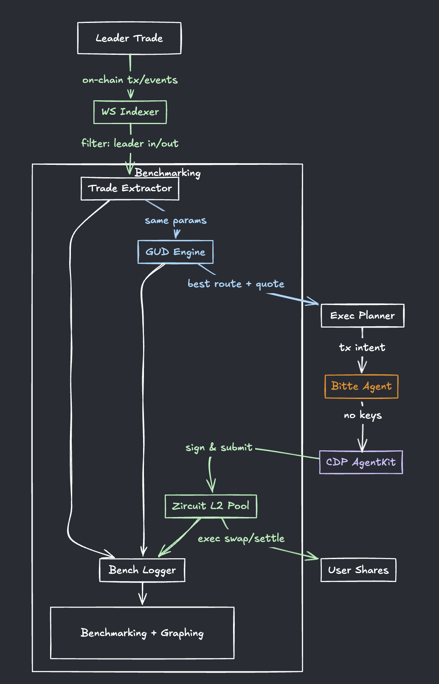
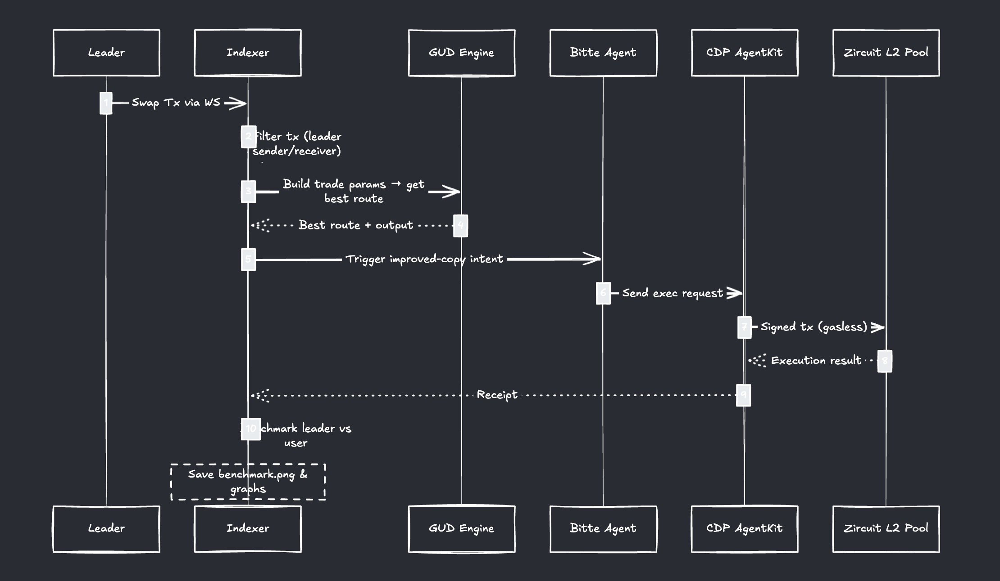

# LeadPool
Copy Leader Trades — But Better

---

## *Overview*

This project is a *leader trade copier* with a twist:
We don’t just mirror the leader’s swaps — we *improve them*.

Using our *real-time on-chain indexer, we detect every swap the leader makes. Instead of blindly copying, we run the **same trade parameters through GUD Trading Engine*, which calculates the best possible route across multiple DEXs/bridges.

*Result:* Every copied trade is executed with *better output amounts* than the leader’s original trade.

---

## *How It Works*

1.⁠ ⁠*Detect Leader Trades*

   * Our custom WebSocket indexer monitors all transactions and events.
   * It filters for trades where the *leader address* is the sender or receiver.

2.⁠ ⁠*Analyze & Quote via GUD Engine*

   * The same token pair, amounts, and direction as the leader’s trade are passed into *GUD Engine*.
   * GUD Engine benchmarks all available swap routes and picks the most profitable one.

3.⁠ ⁠*Execute via Agent Stack*

   * *Bitte Agent*: Watches leader activity and triggers trade execution.
   * *CDP AgentKit*: Executes the trade on-chain (since Bitte Agents can’t own wallets).

4.⁠ ⁠*Benchmark & Visualize*

   * Every trade is compared side-by-side with the leader’s trade.
   * Results show a clear edge — users consistently get better prices.
   * ⁠ benchmark.png ⁠ and performance graphs illustrate this gain.

---

## *Key Components*

•⁠  ⁠*Zircuit L2 Contract*

  * Ownerless pooled contract for gasless trade execution.
  * Current setup benchmarks USDC → ETH across chains.
  * Withdrawal shares are proportional to contributed capital.

•⁠  ⁠*GUD Trading Engine*

  * The secret sauce for route optimization.
  * Ensures copied trades always beat leader’s output.

•⁠  ⁠*Bitte Agent + CDP AgentKit*

  * *Bitte Agent* monitors & decides.
  * *CDP AgentKit* executes transactions securely.

•⁠  ⁠*State-of-the-Art Indexer (WebSocket)*

  * Live chain feed.
  * Filters for relevant trades.
  * Triggers improved trade execution.

---

## *Results*

•⁠  ⁠100% of copied trades in our benchmark outperformed the leader’s output.
•⁠  ⁠See ⁠ benchmark.png ⁠ for raw data.
•⁠  ⁠Graphs in ⁠ /graphs ⁠ show the consistent *edge* we maintain.

---

Leader Trade → Indexer → GUD Engine (find better route) → AgentKit Execution → Better Trade Result
